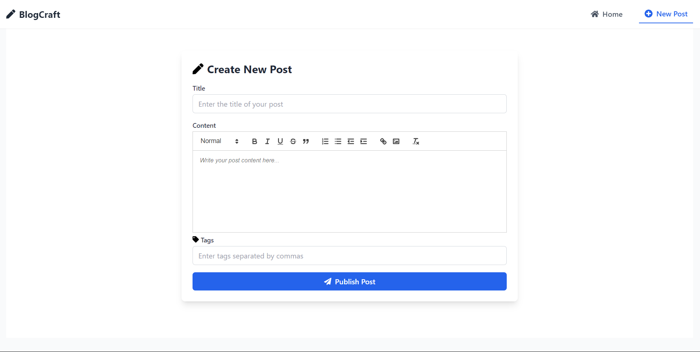
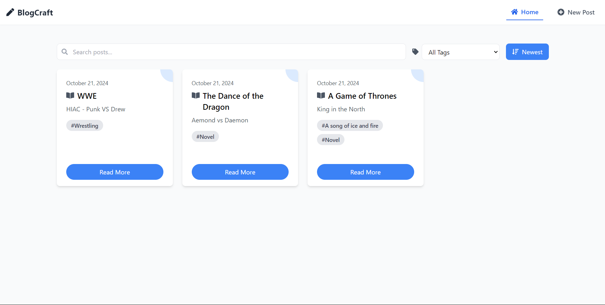
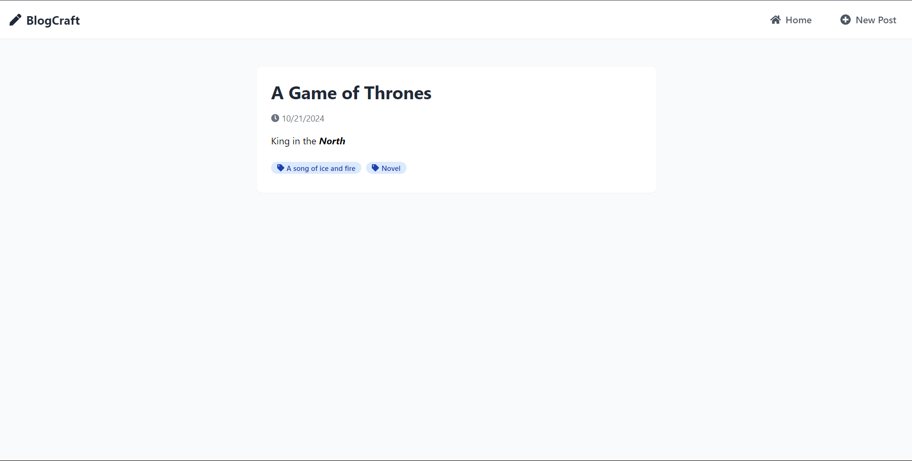

# Blog Site with React

A responsive blog site built using React, where users can create, view, search, and filter blog posts. The blog includes a rich text editor for composing posts, and all posts are persisted locally. The project is built using Vite for fast development, and React hooks are used for state management.

## UI




## Introduction

This React application allows users to create and manage blog posts. Each post consists of a title, description (rich text), date, and tags. Users can search, sort, filter, and preview blog posts. The project also demonstrates responsive design and best practices in state management and code optimization.

## Features

- Create new blog posts with title, description, date, and tags.
- Rich text editor (using React Quill) for blog descriptions.
- View all blog posts in a list format.
- Search posts by title.
- Sort posts by date.
- Filter posts by tags.
- Preview blog posts with full details (title, description, date, and tags).
- Responsive design for both mobile and desktop.
- Posts are persisted locally using local storage.

## Installation

1. Clone the repository from GitHub:
   ```bash
   git clone https://github.com/your-username/react-blog-site.git
   cd react-blog-site
   ```
